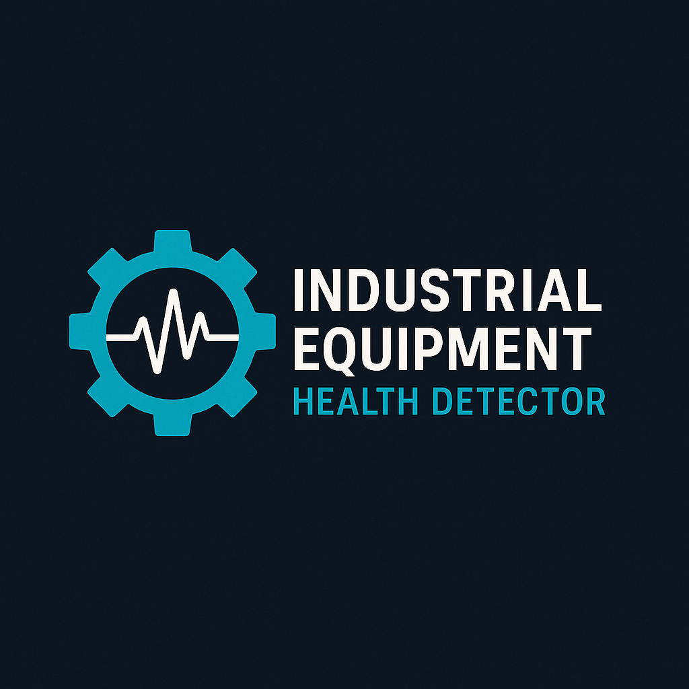

<table align="center">
  <tr>
    <td></td>
    <td><h1><strong>Industrial Equipment Health Monitoring System</strong></h1></td>
  </tr>
</table>

A comprehensive system to monitor and analyze industrial equipment health using sensors, real-time data processing, and machine learning to predict maintenance needs and prevent failures.

---

##  Overview

This project integrates sensor data from ESP32-CAM and vibration sensors to monitor machinery conditions in real-time. It processes data using a backend powered by FastAPI and provides a user-friendly React frontend dashboard for visualization and alerts.

---

##  Features

- Real-time equipment health monitoring using vibration and camera sensors
- Data acquisition and processing with ESP32 and FastAPI backend
- Predictive maintenance with machine learning algorithms
- Responsive React-based dashboard for live status and historical data
- Alerts and notifications for anomalies or potential failures

---

##  Skills & Technologies:
-IoT & Embedded Systems: ESP32-CAM, Vibration Sensor, Arduino IDE /n
-Computer Vision: Eulerian Video Magnification (EVM), OpenCV, MatPlotlib, Scipy, Moviepy /n
-Backend Development: FastAPI, Python, Asynchronous Processing /n
-Networking: TCP Protocol, Custom Retransmission Logic, Microcontroller-PC Communication /n
-Frontend: TypeScript, React, Streaming Integration /n
-Data Handling: Frame Capture, Real-time Processing, Storage Optimization /n

---
